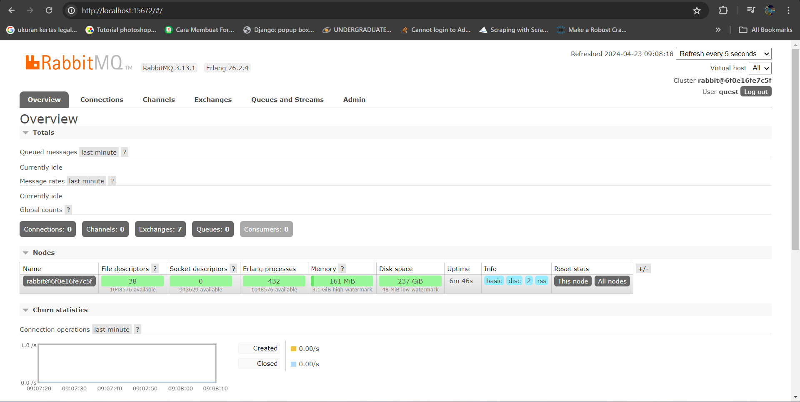
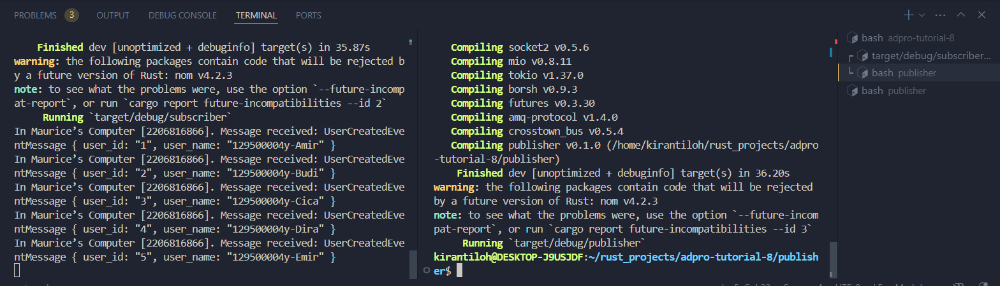
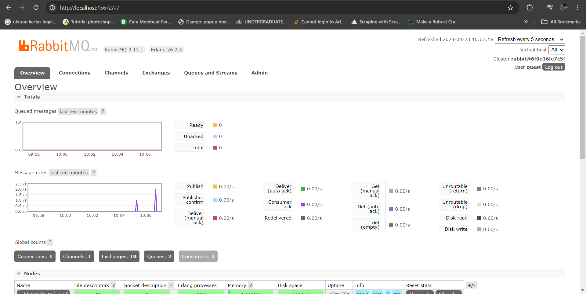

## Reflection
a. Program publisher akan mengirimkan 5 message kepada broker karena terdapat 5 panggilan fungsi `publish_event()`
b. Publisher dan subscriber menggunakan message broker yang sama agar publisher bisa mengirim message dan subscriber bisa menerima message dari message broker yang sama
## Running RabbitMQ

## Processing Events

## Monitoring in RabbitMQ

Lonjakan tersebut disebabkan oleh message yang dikirimkan dari publisher. Grafik tersebut menunjukkan tingkat pengiriman message sehingga muncul lonjakan ketika program publisher dijalankan.