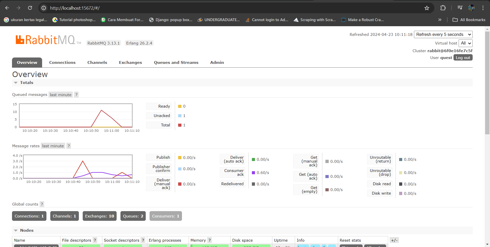

## Reflection
a. AMQP (Advanced Message Queuing Protocol) adalah sebuah protokol pengiriman pesan yang dirancang untuk memfasilitasi komunikasi antar aplikasi atau layanan secara efisien dan andal, serta dalam mode asinkron. Protokol ini memungkinkan pertukaran pesan antara sistem dengan dukungan untuk skenario routing yang kompleks dan jaminan pengiriman pesan. Berbeda dengan HTTP yang lebih sering digunakan untuk komunikasi permintaan-respon, AMQP difokuskan pada komunikasi berbasis pesan, sering kali dalam model publikasi-langganan atau antrian, dan menyediakan fitur seperti pengakuan pesan dan penyimpanan antrian.
b. Guest pertama menandakan username, guest kedua menandakan password, dan localhost:5672 menandakan ip:port yang digunakan untuk menerima message.
## Simulating slow subscriber

Grafik queued messages mengalami lonjakan ketika simulasi subscriber yang lambat karena subscriber hanya bisa consume message dengan kecepatan itu dan message yang dikirimkan publisher masih ada yang belum di consume. Message yang belum di-consume akan ditahan dalam sebuah antrian dan akan ditahan sampai ada subscriber yang dapat consume message lagi.